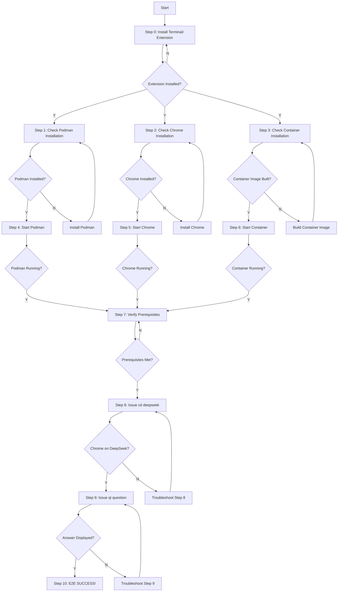

# Terminail End-to-End Testing Guide

## 🎯 Objective
This guide provides a step-by-step process to test the complete Terminail end-to-end workflow. Each step includes user confirmation points (Y/N) to help identify exactly where issues occur.

## 🔄 Flow Chart

## 📋 Step-by-Step Testing Process

### Step 0: Install Terminail Extension
- **Script**: `00_install_terminail_extension.py`
- **Action**: Install Terminail Extension to VS Code
- **Verification**: Check if VS Code opens with Terminail extension
- **User Confirmation**: "Did VS Code open with Terminail extension? (y/N): "

### Step 1: Check Podman Installation
- **Script**: `01_check_podman_installation.py`
- **Action**: Check if Podman is installed and working
- **Verification**: Verify Podman version and installation status
- **User Confirmation**: "Is Podman installed and accessible? (y/N): "

### Step 2: Check Chrome Installation
- **Script**: `02_check_chrome_installation.py`
- **Action**: Check if Chrome is installed on the system
- **Verification**: Locate Chrome executable on system
- **User Confirmation**: "Is Chrome installed on this system? (y/N): "

### Step 3: Check Container Installation
- **Script**: `03_check_container_installation.py`
- **Action**: Check if terminail-mcp-server container image is built
- **Verification**: List available Podman images
- **User Confirmation**: "Is terminail-mcp-server image available? (y/N): "

### Step 4: Start Podman
- **Script**: `04_start_podman.py`
- **Action**: Start Podman service if not already running
- **Verification**: Check Podman machine status
- **User Confirmation**: "Is Podman running successfully? (y/N): "

### Step 5: Start Chrome
- **Script**: `05_start_chrome.py`
- **Action**: Start Chrome with debug port 9222 and host Chrome service
- **Verification**: Check if Chrome is running on debug port and host service is listening
- **User Confirmation**: "Is Chrome running with debug port 9222? (y/N): "

### Step 6: Start Container
- **Script**: `06_start_container.py`
- **Action**: Start terminail-mcp-server container from image
- **Verification**: Check if container is running
- **User Confirmation**: "Is the terminail-mcp-server container running? (y/N): "

### Step 7: Verify Prerequisites
- **Script**: `07_verify_prerequisites.py`
- **Action**: Confirm all prerequisites are met
- **Verification**: Validate all services and connections
- **User Confirmation**: "Are all prerequisites met? (y/N): "

### Step 8: Issue 'cd deepseek' Command
- **Script**: `08_send_cd_deepseek_command.py`
- **Action**: Send 'cd deepseek' command from Terminail
- **Verification**: Check if Chrome navigates to DeepSeek website
- **User Confirmation**: "Is Chrome now on the DeepSeek website? (y/N): "

### Step 9: Issue Question Command
- **Script**: `09_send_qi_deepseek_command.py`
- **Action**: Send 'qi <question>' command from Terminail
- **Verification**: Check if answer is displayed in Terminail terminal
- **User Confirmation**: "Is the answer displayed in Terminail terminal? (y/N): "

### Step 10: E2E Success
- **Script**: `10_confirm_e2e_success.py`
- **Action**: Confirm full end-to-end success
- **Verification**: All steps completed successfully
- **Result**: "🎉 TERMINAI E2E TEST SUCCESSFUL!"

## 🛠️ Troubleshooting Guide

### If Step 8 Fails (Chrome not on DeepSeek)
- Check Chrome debug port connection
- Verify ChromeManager configuration
- Check container-to-host communication
- Validate network connectivity to DeepSeek

### If Step 9 Fails (Answer not displayed)
- Check AI service response parsing
- Verify Chrome automation is working
- Check network connectivity
- Validate response formatting

## 🎉 Success Criteria
- When user confirms "Y" to both Step 8 and Step 9 questions, the full end-to-end test is successful!